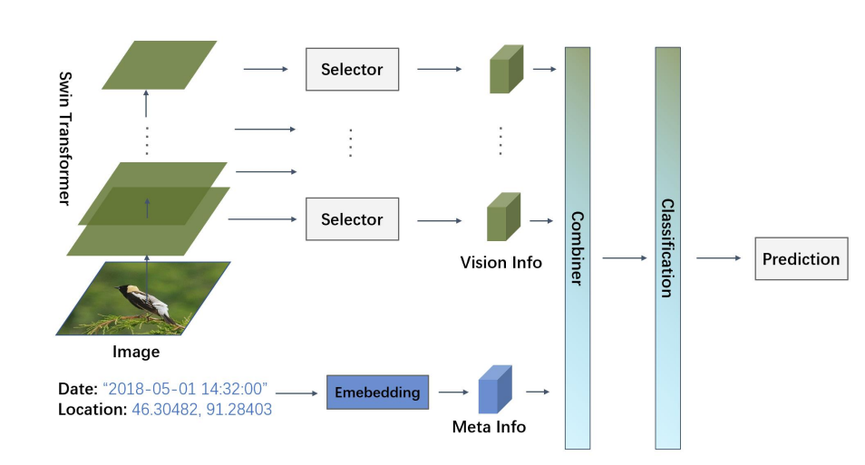
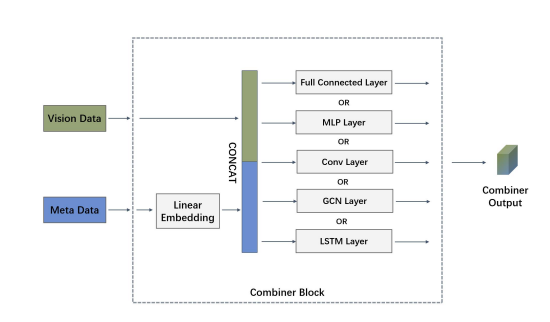

# METASwin: A Meta Information-Aware Network For Fine-Grained Visual Classification

We use a Swin Transformer and add processed meta-information to it to complete the FGVC task. Our model is equipped with a plug-in module from [FGVC-PIM](https://github.com/chou141253/FGVC-PIM) which can output pixel-level feature maps and fuse filtered features. Then, we add meta-information to it and try to further improve the performance of this model. Adding meta information, we found that the accuracy of classification can be improved compared with just training with visual information. The source code and the pre-trained models are attached in the same zip file.





### 1.0 Environment

In this section we demonstrate how to prepare an environment with PyTorch.  Linux system is recommended.

- We recommend Python 3.7+

- We recommend PyTorch 1.9+

- We recommend CUDA 11.0+

- We recommend W&B

  Here is a quick start to prepare for the environment

```
conda activate --name metaswin python==3.7
conda activate metaswin
pip install -r requirements.txt
```

### 1.1 Dataset

In this paper, we use 2 subset of [iNaturalist2018](https://github.com/visipedia/inat_comp/tree/master/2018) datasets to evaluate performance

train data and test data structure:
```
├── train/
│   ├── class1/
│   |   ├── img001.jpg
│   |   ├── img002jpg
│   |   └── ....
│   ├── class2/
│   |   ├── img001.jpg
│   |   ├── img002jpg
│   |   └── ....
│   └── ....
└──
```
### 1.2 Pretrained Model

You may download the pretrained model from this url: https://drive.google.com/drive/folders/1ivMJl4_EgE-EVU_5T8giQTwcNQ6RPtAo?usp=sharing

### 2. Configuration

you can directly modify yaml file (in ./configs/)

### 3. Run
```
python main.py --c ./configs/CUB200_SwinT.yaml
```

### Acknowledgment

Many thanks to our professor!


